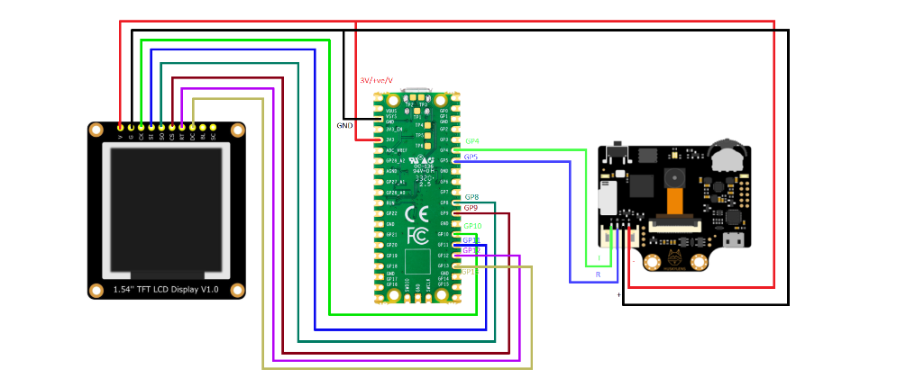
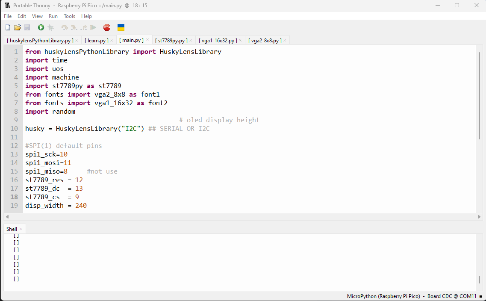

# Getting Started

Read this link - [https://community.dfrobot.com/makelog-311712.html] to get started.

## Schematic

Connect Rx and Tx of Huskylens to Rx and Px pin of Pico as follow

```
- Husky Lens  --- PiCO
- RX (Green)  ---- GP4
- TX (Blue )  ---- GP5
```


## To Run
```
1. Install thonny (See thonny setup and how it flash the PiCO)
2. Open thonny and place all the code in Rpi PiCO as follow
3. Run `main.py` code to run all the detections function
```




